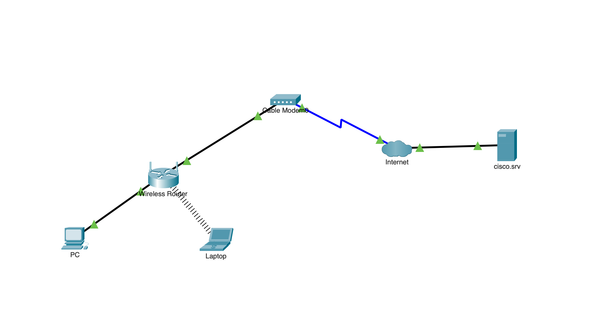

# ccna-packet-tracer-labs
Hands-on networking labs using Cisco Packet Tracer covering CCNA fundamentals such as IP addressing, DHCP, and wireless networking.

# CCNA Packet Tracer Labs

## 📌 Overview

This repository contains hands-on networking labs built using Cisco Packet Tracer. The labs are designed to develop practical skills in networking fundamentals aligned with CCNA-level concepts.

## 🎯 Goals

* Build real networking scenarios
* Practice configuration and troubleshooting
* Document learning progress
* Prepare for CCNA certification

## 🧪 Labs Included

### 🔹 Simple Home Network

* Wired and wireless devices
* DHCP configuration
* Internet connectivity via cable modem
* Troubleshooting wireless connection issues

## 🛠️ Tools Used

* Cisco Packet Tracer

## 📚 Skills Developed

* IP addressing
* DHCP
* Wireless networking
* Network troubleshooting

## 🚀 Progress

This repository will continue to grow with more advanced labs, including:

* Static IP configuration
* VLANs
* Routing
* Network troubleshooting scenarios

## 🔧 Challenges & Fixes

- DHCP request failed → fixed by correcting router/modem connection
- Laptop could not connect to Wi-Fi → installed WPC300N adapter
- "No association with access point" → connected to correct SSID (HomeNetwork)
